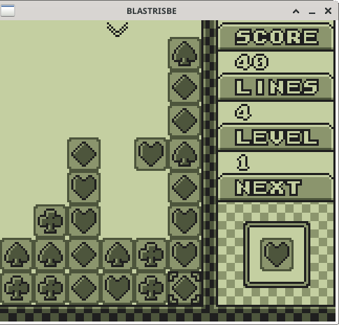
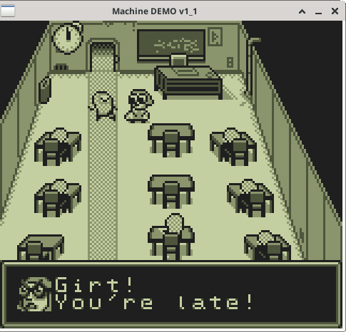
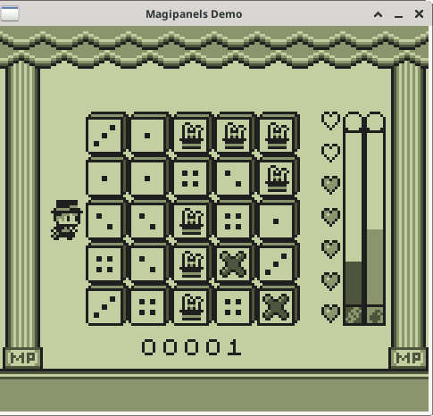
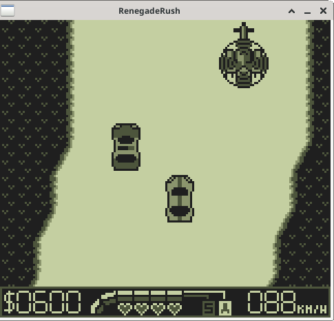
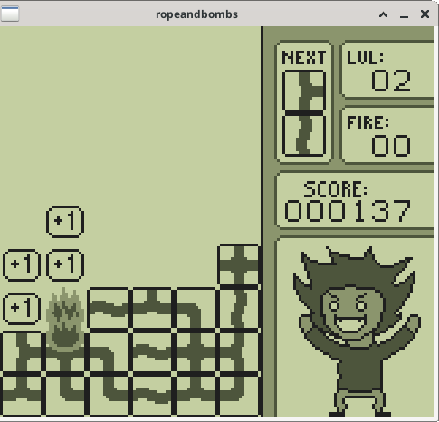

# Game Boy Emulator

This is not a full release of my emulator. I have no plans to release
it. I'm still quite proud of this project, as it was very challenging
and outside my background in scientific computing. Here I'm sharing
excepts of my code, with discussions in README files about my design
decisions, along with testing and performance where applicable.

Here is a quick summary of useful design patterns and valuable
principles and paradigms implemented in classes.

- Design Patterns:
  - Facades: SDL [visuals](./windows) and [audio](./performance_and_audio)
  - Factory Method: [cartridge](./cartridge)
  - Mediators: [BUS](./bus)
  - State Machine: [PPU](./ppu)
- Classes:
  - Dynamic Polymorphism: [assembly](./assembly) and [cartridge](./cartridge)
  - Static Polymorphism/Templates: [assembly](./assembly)
  - Inheritance: [windows](./windows), [assembly](./assembly) and [cartridge](./cartridge)
  - RAII: [battery](./resource_management/battery.hpp)

# Examples

These games were downloaded from [itch.io](https://itch.io/), a
website for publishing and selling modern games. These games were all
released between 2017-2022 and developed by hobbyists.

BlasTrisBE | The Machine Demo | Magipanels Demo
:---------:|:----------------:|:--------------:
 |  | 

Renegade Rush | Rope and Bombs
:------------:|:-------------:
 | 
