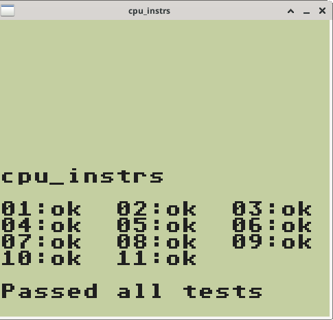
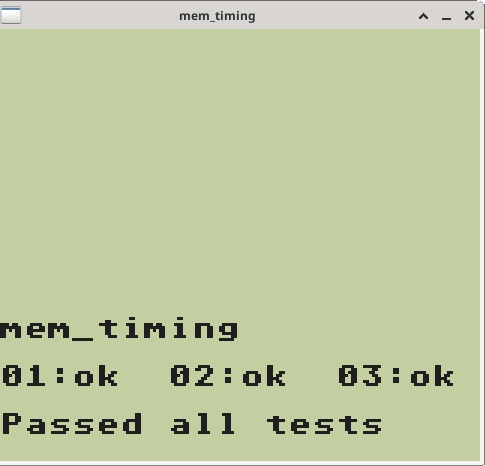
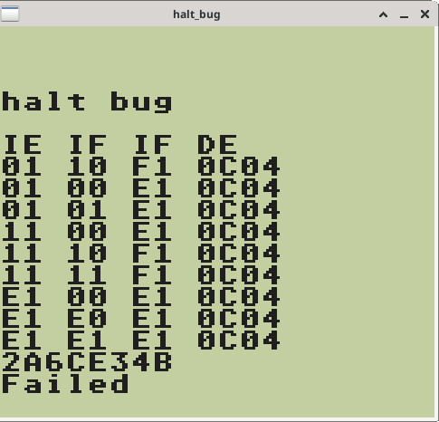

# Assembly Instructions

The Game Boy's instruction set read by the CPU contains 500
instructions. Their purpose is to get, set, manipulate, and/or move
bytes of data between memory and the registers.

Efficiently writing the code for so many instructions required both a
mix of dyanamic and static polymorphism, as described below.

## Dynamic Polymorphism

Taking a look at the implementation of ```get_instruction()``` in
[instructions.cpp](instructions.cpp) will give some sense of the
purpose of dynamic polymorphism for instructions. It works by reading
one or two bytes of memory, and then returning the corresponding
element of instruction arrays. Dynamic polymorphism ensures any
instruction, regardless of its (derived) type, can be properly
executed elsewhere.  It also enables the instructions to be stored in
and looked up from array, which ended up being a hair faster than if
done with a switch statement.

The [abstract class interface](instr_interface.hpp) defines two
virtual methods that are especially important here: ```decode``` which
parses any data, and ```execute``` which evaluates and sets any
operations. Most instructions needed to override both of the these
virtual methods. A simple set of instructions using operation
overriding to define these methods can be seen in
[instr_call](instr_call.hpp).

Furthermore we can see an example of operation overloading here as
well.  The instruction ```CALL_N16``` calls a function at a 16-bit
address, while ```CALL_F_N16```, which is derived from ```CALL_N16```,
extends its functionality only to call a method if a flag has been
set.

## Static Polymorphism

Inheritance made sense in the last example, since while most of the
code was the same between ```CALL_N16``` and ```CALL_F_N16```, the
flag did result in a distinct difference.

Many other instructions are the exact same, only differing by
combinations of arguments: an 8-bit register, a 16-bit registers, a
byte, two bytes, or an address. In these cases multi-layer inheritance
isn't necessary. Rather, all that is needed is static polymorphism
using templates to build a set of instructions.

A simple example using static polymorphism is the [XOR](instr_xor.hpp)
instruction. This instruction runs the XOR operation between an 8-bit
register and either another 8-bit register, a byte in ROM, or a byte
at a 16-bit address in RAM. Using templates, only one derived class of
the interface ```Instruction``` needed to be written.

## Future Work

While my approach does work quite well and greatly accelerated
development, the major drawback is that each instruction can take 1-6
cycles to complete.  This makes syncing the CPU with other processing
units quite tricky. I addressed this syncing issue with as best I
could with ```IO::timer.add_cycles``` calls (see
[instr_call](instr.call.cpp) or [arg_bytes](arg_bytes.cpp)). However,
I think a State Machine design pattern would be a far more flexible
approach. See [PPU](../ppu) for an example of this.

# Testing

## Assembly Scripts

My first tests with the emulator were simple assembly scripts to test
some tricky instructions. I implemeted instruction and register
printouts (as shown below) for validation purposes. An example
included here is for the [sub](sub.asm) instruction, designed
specifically to confirm that flags get set properly when doing
subtraction operations. Flag Z is set if the result is 0, while H and
C are set for specific cases of carrying.

```
00000000 - 0100: JP N16                     (C3 50 01) A:01 F:Z-HC BC:0013 DE:00D8 HL:014D SP:FFFE PC:0102
00000010 - 0150: LD A N8                    (3E 80 97) A:01 F:Z-HC BC:0013 DE:00D8 HL:014D SP:FFFE PC:0152
00000018 - 0152: SUB A A                    (97 3E 08) A:80 F:Z-HC BC:0013 DE:00D8 HL:014D SP:FFFE PC:0154
0000001C - 0153: LD A N8                    (3E 08 97) A:00 F:ZN-- BC:0013 DE:00D8 HL:014D SP:FFFE PC:0155 <-- Flags set
00000024 - 0155: SUB A A                    (97 3E 00) A:08 F:ZN-- BC:0013 DE:00D8 HL:014D SP:FFFE PC:0157
00000028 - 0156: LD A N8                    (3E 00 06) A:00 F:ZN-- BC:0013 DE:00D8 HL:014D SP:FFFE PC:0158
00000030 - 0158: LD B N8                    (06 81 90) A:00 F:ZN-- BC:0013 DE:00D8 HL:014D SP:FFFE PC:015A
00000038 - 015A: SUB A B                    (90 3E 00) A:00 F:ZN-- BC:8113 DE:00D8 HL:014D SP:FFFE PC:015C
0000003C - 015B: LD A N8                    (3E 00 06) A:7f F:-NHC BC:8113 DE:00D8 HL:014D SP:FFFE PC:015D <-- Flags set
00000044 - 015D: LD B N8                    (06 80 21) A:00 F:-NHC BC:8113 DE:00D8 HL:014D SP:FFFE PC:015F
0000004C - 015F: LD HL N16                  (21 80 80) A:00 F:-NHC BC:8013 DE:00D8 HL:014D SP:FFFE PC:0161
00000058 - 0162: LD [HL] B                  (70 D6 80) A:00 F:-NHC BC:8013 DE:00D8 HL:8080 SP:FFFE PC:0164
00000060 - 0163: SUB A N8                   (D6 80 96) A:00 F:-NHC BC:8013 DE:00D8 HL:8080 SP:FFFE PC:0165
00000068 - 0165: SUB A [HL]                 (96 10 00) A:80 F:-N-C BC:8013 DE:00D8 HL:8080 SP:FFFE PC:0167 <-- Flags set
00000070 - 0166: STOP                       (10 00 00) A:00 F:ZN-- BC:8013 DE:00D8 HL:8080 SP:FFFE PC:0168 <-- Flags set
```

## Test ROMS

The test suite by [Blarg](https://github.com/retrio/gb-test-roms)
includes a great set of tests for instructions. My emulator passes the
most important tests which are a general set of tests for instructions
and some tests for timings of memory reads and writes. Not all tests
pass, such as the HALT bug test, but to my knowledge correctly
replicating this bug is only necessary for 2-3 games, making it
extremely low priority for me.

CPU Instructions | Memory Timing | Halt Bug
:---------------:|:-------------:|:-------:
 |  | 
