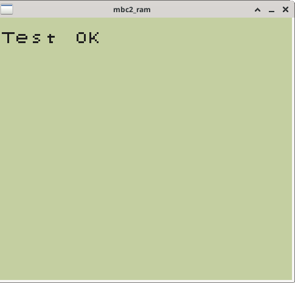
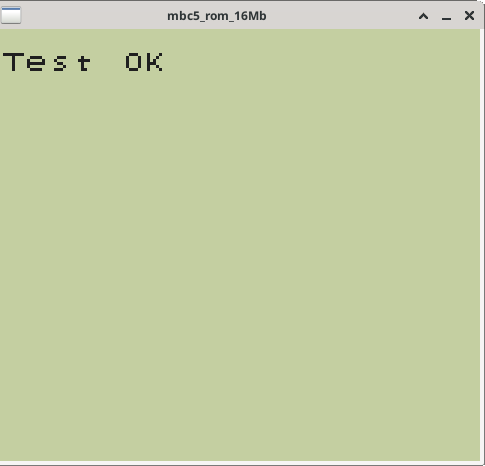

# Cartridges

Game cartridges vary among games. Common differences are the amounts
of memory (ROM and RAM) included, how they read/write data, and the
ability to save game data (battery). More unique differences include a
clock for keeping time (RTC), and the ability to rumble.

I found the most useful methods were to write an Interface/Abstract
Class for cartridges and a Factory Method to construct the cartridge
with all the correct settings and components.  Derived classes are
responsible for overriding virtual methods as necessary and building
unique components as necessary.

Examples given are for the MBC2 and MBC3 cartridge types. The most
notable distinction is the option for a Real Time Clock (RTC) timer in
MBC3 cartridge types. The MBC3 code extends ```Cartridge::tick``` with
the following code,

```C++
void MBC3::tick() {
    Cartridge::tick();
    if (m_has_timer)
        m_rtc.increment();
}
```

while the MBC2 cartridge type uses the default definition. Other
differences between them are in how they override methods for reading
from and writing to memory. Additionally, MBC2 always has a fixed
amount of RAM, while that of MBC3 varies as needed.

# Testing

For testing cartridges I used the [Mooneye Test
Suite](https://github.com/Gekkio/mooneye-test-suite).  While no tests
exist for MBC3, all tests pass for MBC1, MBC2, and MBC5.  A few test
results are shown below.

MBC1 | MBC2 | MBC5
:---:|:----:|:---:
 |  | 
