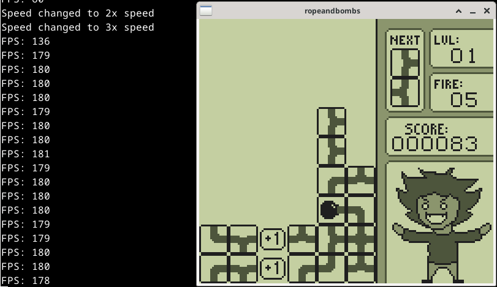

## Audio & Framerate

Audio is implemented using the SDL2 library. The SDL2 API is a bit
complex, so the Audio class is implemented as a Facade design pattern
to simplify initializing, terminating, and queuing audio data.

This class also serves a secondary purpose, and that is to fix and
adjust the game's frame rate. Since audio data is emptied from the
queue at a fixed rate, simply waiting for the queue to empty every
time the queue is to be filled will fix the frame rate. That is the
purpose of the following line in ```Audio::queue```.
```C++
    while (SDL_GetQueuedAudioSize(device)) {};
```
Adjusting the emulator's frame rate can be handled by adjusting either
the frequency or sample parameters used by SDL. I implmemented it by
adjusting the frequency.

## Audio Testing

I performed audio testing using a test rom built by
[Blarg](https://github.com/retrio/gb-test-roms). While not perfect,
the audio during gameplay sounds fine to me. Some other emulators to
pass these tests perfectly (bingb, SameBoy), not all do.  For example,
MBGA fails test #10, while ZBoy fails tests #2, #3 and gets stuck on
#4, and they both still produce great sounding audio!


## Emulator Performance

A good measure of performance of an emulator is measuring the
framerate. At the very least, a Game Boy emulator should have a steady
framerate of 60 fps.

Thanks to my implementation of the Audio class, its easy for me to
adjust the framerate as needed for testing purposes. Below are some
results from my testing with the game Rope And Bombs. My emulator gets
a steady framerate up to 180 fps, 3 times the necessary 60 fps
framerate. At 4 times the default speed it is a little slow at around
230 fps.

Default Speed | Double Speed
:------------:|:-----------:
 | 

Triple Speed | Quadruple Speed
:------------:|:-----------:
 | 
