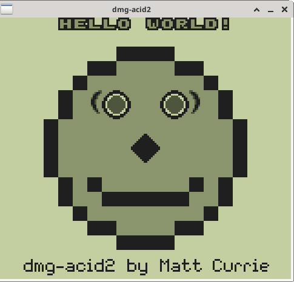

# Graphics

Graphics are handled by the PPU (Pixel Processing Unit). This is
extremely tricky since the pixel processing needs to be well-synced
with the CPU at all times.The CPU handles transferring memory
(background images, sprites, etc.), while the PPU handles reads that
memory and displays it on an LCD. If they're out of sync, erroneous
data will get displayed, sprites may flicker, etc.

The design pattern most applicable here is the State Machine. Every
state is associated with a method to be evaluated, which represents a
single tick of the PPU's clock. This design pattern provided
flexibility for adjusting, inserting, and removing methods as needed
for syncing purposes.

Methods involve finding an address to read, loading data, processing
data, queue a pixel, and even doing nothing just to stay properly
synced with the CPU. The [example](pipeline.cpp) is only an excerpt of
the code for the sake of clarity.

On every PPU tick, ```Pipeline::process`` gets called. It executes
whatever method is set for the current state. Methods shown are the
sequence for processing and queuing a single pixel of the background
image displayed on screen.

The full process includes other layers: a window and sprites. Some
window methods do overlap with the background methods (every ```bgw```
denotes this), but others are omitted here. Sprites take additional
steps (not shown) and can overwrite any pixels placed in the queue.

# Testing

An popular test for the PPU is Matt Curie's
[dmg-acid2](https://github.com/mattcurrie/dmg-acid2) test, which
displays the iconic Acid2 smily face used by web browsers on the
emulator's screen. The test is designed to confirm layers superimpose
on each other properly. Failures will have errors like a missing nose,
or a mole on the left cheek. Below is an image from a successful test
on my emulator.


