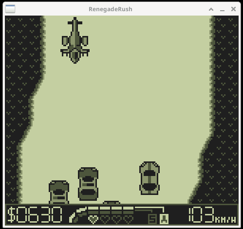
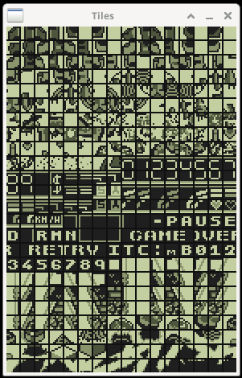
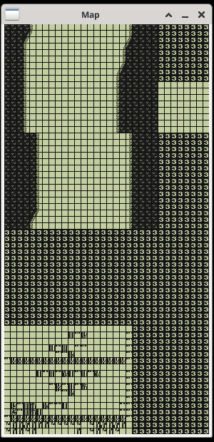

# Windows

Graphics are displayed in video windows from the SDL2 library. The
SDL2 API is complex, so I implemented a [Window class](./window.hpp)
using the Facade design pattern to facilitate development. This
simplified rendering data and opening/closing windows, facilitating
development of derived classes that could extend rendering
functionality to display different sets of data. It was used not only
for the [game window](./window_game.cpp), but also for creating
additional windows for testing purposes.

Two testing windows implemented are the [tile
window](./window_tiles.cpp) and the [map
window](./window_map.cpp). The tile window contains a set of tiles
which join together to build images displayed on the game windows. The
map window displays a region of memory, a subregion of which is
actually the game window. These tests windows were extremely helpful
confirming that I was reading correct regions of memory and processing
the pixel data correctly.

Game | Tiles | Map
:---:|:-----:|:--:
 |  | 
