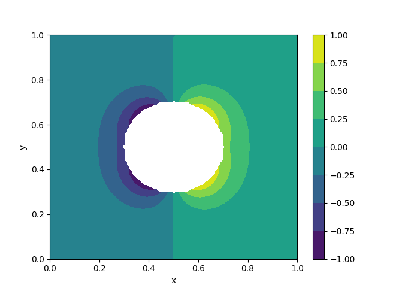

# Laplace Equation PDE Solver with Irregular Geometry

This is an implementation of a finite difference scheme developed to
solve Laplace's equation on an irregular grid using a blocking out
approach. This problem is adapted from Chapter 11 of the textbook
"Numerical Partial Differential Equations: Conservation Laws and
Elliptic Equations" by J. W. Thomas.

# Overview

## The Problem

The goal is to solve Laplace's equation

on a domain outside of a circle,

with boundary conditions of

on the surface of the circle and 0 on the edges of the domain.

## The Scheme

The problem is solved on a regular grid with a simple, iterative
central difference scheme by blocking out gridpoints contained in the
circle, and applying an alternative, first-order scheme to gridpoints
surrounding the circle. This alternative scheme follows the form of

where `rho = d / delta x`, and `d` is the distance between the
gridpoint and the surface. Note that this scheme is specifically for
the x-axis and approaching the circle from the right. Simlar schemes
need to be added for the other three directions.

My implementation generalized this scheme to include all four
directions in a single scheme. I organized it in a way to make it
parallelizable with OpenMP, leading to an approximately 2.5x speedup
in my examples.

## Results

My code implements the solver in `scheme.cpp`. The impementation is
designed to work with different parametric functions, so it should
work for any simple shape that can be defined by pair of functions,
e.g. for a circle, the functions would be (cos(s), sin(s)) for (x,y).

Below or some plots of several shapes, including a circle and a star.

# Usage

The code can be compiled by changing into the source directory and
running CMake or `make all`. Libraries required include the GNU
Scientific Library (GSL), Boost, and BLAS. It was only developed and
tested on Linux distributions.

Compiling will build examples and leave the executables in `build/bin`
by default. Running it will dump data files that can be plotted with
the script in `tools`.

For running with different shapes, a new child of the Shape class will
need to be defined. See `examples/exmample_01_circle.cpp` for an
example with a circle shape, and
`examples/exmample_02_star_and_square.cpp` for examples of star and
square shapes. Example 2 also demonstrates features of the builder
design pattern, allowing users a simple way to set a new shape and/or
grid and then rerun the solver.