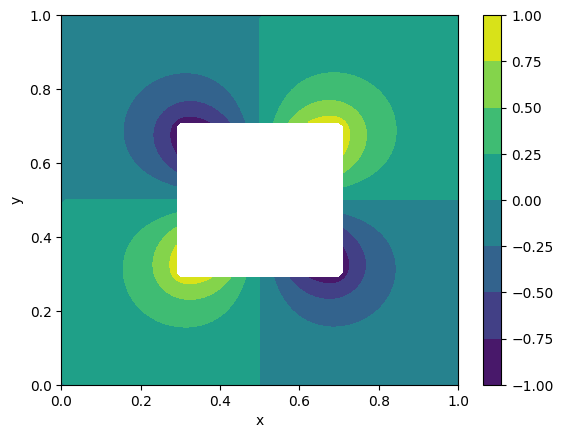
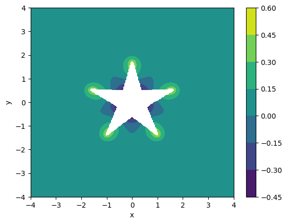

# Elliptic PDE Solver with Irregular Geometry

This is an implementation of a finite difference scheme developed to
solve elliptic PDEs on an irregular grid using a blocking out
approach. This problem is adapted from Chapter 11 of the textbook
"Numerical Partial Differential Equations: Conservation Laws and
Elliptic Equations" by J. W. Thomas.

This version was tranlated to C++ from my Python version. It
demonstrates the use of classes, structs, templates, and parallelizing
with OpenMP.

# Overview

## The Problem

The goal is to solve Laplace's equation

on a domain outide of a circle,

with boundary conditions being

on the surface of the circle, and being 0 on the edges of the domain.

## The Scheme

The problem is solved on a regular grid with a simple, iterative
central difference scheme by blocking out gridpoints contained in the
circle, and applying an alternative, first-order scheme to gridpoints
surrounding the circle. This alternative scheme follows the form of

where `rho = d / delta x`, and `d` is the distance between the
gridpoint and the surface. Note that this scheme is specifically for
the x-axis and approaching the circle from the right. Other schemes
need to be added for the other three directions.

My implementation generalized this scheme to include all four
directions in a single scheme, and I organized it in a way simplify
parallelizing with OpenMP. This was crucial for making running the
scheme practical, as it can take 10,000-100,000 iterations to
converge.

## Results

My code implements the solver in `solver.cpp`. The impementation is
designed to work with different parametric functions, so it should
work for any simple shape that can be defined by pair of functions,
e.g. for a circle, the functions would be (cos(s), sin(s)) for (x,y).

Below or some plots of several shapes, including a circle, a square,
and a star.

# Usage

The code can be compiled by changing into the source directory and
running `make`. Libraries required include the GNU Scientific Library
(GSL), Boost, and BLAS.

Compiling will build the `solver` executable in `bin`. Running it will
dump data files that can be plotted with the script in `tools`.

For testing new shapes, a new struct will need to be defined in
`include/solver.h`. It can then be used in the main function.